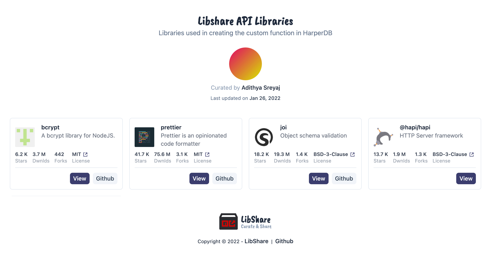

 

  

<h3 align="center">The WFH Store</h3>

  

      Curate and share your favorite JavaScript libraries with other.
       
       
      <a href="https://libshare.adi.so">View Demo</a>
      ·
      <a href="https://github.com/adisreyaj/libshare-web/issues">Report Bug</a>
      ·
      <a href="https://github.com/adisreyaj/libshare-web/issues">Request Feature</a>
  

  

   
   
   
  

Libshare helps you curate and share your favorite NPM libraries with the community. Showcase all the awesome libraries
that you used in your side project and give them visibility. Made for the ♥ of open-source.

